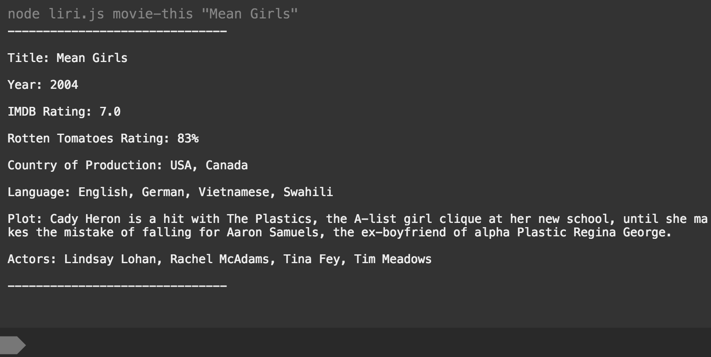

# Liri
This is a Node.js Command Line Interface (CLI) application which takes both a command and a string as input. When running the program via Terminal/Bash, the user must navigate to the folder containing the application, then type the following and press Enter:

`node liri.js command string`

 The commands and strings work as follows:

* `my-tweets`: This command doesn't require a string. It prints Oprah's twenty most recent tweets.
* `spotify-this-song "Name of Song"`: This command takes the name of the song the user has entered and returns information from Spotify about the song (album, preview link, artist, etc.).
* `movie-this "Name of Movie"`: This command takes the name of the movie the user has entered and returns information from the OMDB (movie database) about the movie.
* `do-what-it-says`: This command doesn't require a string. It reads the random.txt file for the command and string, and executes it normally.

## Screenshot

## Contributors
Daniel Sullivan
